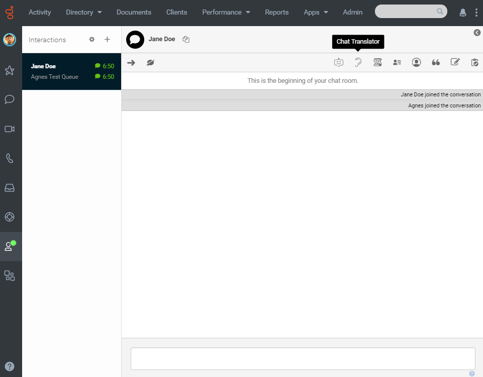

  This Genesys Cloud Blueprint provides instructions for building a chat translation assistant which uses the AWS Translate service to allow customers and agents to chat in their preferred languages. The chat translation assistant automatically translates everything in the chat window in real-time, including canned responses.


## Solution Components
* **Genesys Cloud** - A suite of Genesys cloud services for enterprise-grade communications, collaboration, and contact center management. You deploy the Chat Translator solution in Genesys Cloud.
* **Genesys AppFoundry** - The Genesys app marketplace for solutions that run on the Genesys Cloud platform. You download the integration used in this solution from the Genesys AppFoundry.
* **Interaction Widget Integration** - The Genesys Cloud integration that enables web apps to be embedded in an iframe within Genesys Cloud. The iframe only appears on specified interaction types and to specified agents. For this solution, Genesys Cloud uses the Interaction Widget Integration to translate and send chat messages to the customer.
* **AWS Identity and Access Management (IAM)** - Identity and Access Management that controls access to AWS resources such as services or features. In this solution, you set up the permissions to allow the Chat Translator to access Amazon Translate and the AWS SDK.
* **Amazon Translate** - A translation service that delivers fast, high-quality, and affordable language translation. Amazon Translate is the translation service used in the Chat Translator solution.

### Software development kits (SDKs)
* **Genesys Cloud Platform API SDK** -Client libraries used to simplify application integration with Genesys Cloud by handling low-level HTTP requests. This SDK is used for the initial chat interaction between agent and customer.
* **AWS for JavaScript SDK** - This SDK enables developers to build and deploy applications that use AWS services. This solution uses the JavaScript API to enable the Chat Translator in an agent's browser and it uses the inside Node.js applications to enable the Chat Translator on the server where Genesys Cloud runs.

## Requirements

### Specialized knowledge
* Administrator-level knowledge of Genesys Cloud
* AWS Cloud Practitioner-level knowledge of AWS IAM, AWS Translate, and AWS for JavaScript SDK
* Experience with using the Genesys Cloud Platform API

### Genesys Cloud account
- Genesys Cloud license. For more information, see [Genesys Cloud Pricing](https://www.genesys.com/pricing "Opens the Genesys Cloud pricing page") in the Genesys website.
- Master Admin role. For more information, see [Roles and permissions overview](https://help.mypurecloud.com/?p=24360 "Opens the Roles and permissions overview article") in the Genesys Cloud Resource Center.

### AWS account

- User account with AdministratorAccess permission and full access to:
  - IAM service
  - Translate service

## Implementation steps

* [Download the repository containing the project files](#Download_the_repository_containing_the_project_files)
* [Create a Token Implicit OAuth Grant for Genesys Cloud](#Create_a_Token_Implicit_OAuth_Grant_for_Genesys_Cloud)
* [Set up AWS Translate](#Set_up_AWS_Translate)
* [Install and activate the Chat Translator on Genesys Cloud](#Install_and_activate_the_Chat_Translator_on_Genesys_Cloud)
* [Host and run the NodeJS app server](#Host_and_run_the_NodeJS_app_server)
* [Test the solution](#Test_the_solution)

### Download the repository containing the project files

1. Clone the [blueprint repository](https://github.com/GenesysAppFoundry/chat-translator-blueprint) to your machine.

### Create a token implicit OAuth grant for Genesys Cloud
1. Log in to your Genesys Cloud organization and create a new OAuth API (Implicit Grant(Browser)). For more information, see [Create an OAuth Client](https://help.mypurecloud.com/articles/?p=188023 "Opens the Create an OAuth client article").
2. In your local blueprint repository, open [config.js](https://github.com/GenesysAppFoundry/chat-translator-blueprint/blob/main/docs/scripts/config.js) and specify the client ID and region for your Genesys Cloud organization. For example: `mypurecloud.ie` or `mypurecloud.au`.

### Set up AWS Translate
1. Create an IAM user for the application. For more information, see [IAM users](https://docs.aws.amazon.com/IAM/latest/UserGuide/id_users.html "Goes to the IAM users page in the AWS documentation")
2. Add a policy to the IAM that grants full access to the AWS Translate service. For more information, see [Managing IAM policies](https://docs.aws.amazon.com/IAM/latest/UserGuide/access_policies_manage.html "Goes to the Managing IAM policies page in the AWS documentation")
3. Create an access key for the IAM user. For more information, see [Managing access keys for IAM users](https://docs.aws.amazon.com/IAM/latest/UserGuide/ "Goes to the Managing access keys for IAM users page in the AWS documentation")
4. Take note of the access key and secret.
5. Create an .ENV file in the directory folder and provide values to the following variables: `AWS_REGION`, `AWS_ACCESS_KEY_ID`, and `AWS_SECRET_ACCESS_KEY`.

::: secondary
**Tip**: Start with the sample.env file for this blueprint and provide your org-specific details.
:::

### Install and activate the Chat Translator on Genesys Cloud

1. Log in to your Genesys Cloud organization and add a new integration. For more information, see [Add an integration](https://help.mypurecloud.com/?p=135807 "Opens the Add an integration article") in the Genesys Cloud Resource Center.

   

2. Install the **Interaction Widget Integration**. For more information, see [Add an integration](https://help.mypurecloud.com/?p=229319 "Opens the Set up an Interaction Widget integration article") in the Genesys Cloud Resource Center.

   

3. **(Optional)** Use the **Name** box to give the widget a meaningful name. For example, `Chat Translator`

   

4. Click the **Configuration** tab.
5. In the **Application URL** box, type the URL of the web application. Be sure to specify the full URL, beginning with `https:`.

   ```{"title":"Application URL example"}
   https://localhost/?conversationid={{pcConversationId}}&language={{pcLangTag}}
   ```
   The `pcConversationId URL` parameter determines the conversation interaction. The `pcLangTag` parameter determines the agent's language in the Chat Translator solution.

6. **(Optional)** To limit access to a specific group of agents, in **Group Filtering***, select the group that can use the widget.

7. **(Optional)** To limit access to specific queues, click **Select Queues** and select the queues that can use the widget.

8. In the **Communication Type Filtering** box, type ```chat```.  

   

5. Click **Advanced** and enter the following code in the text area:

```{"title":"Advanced tab contents","language":"json"}
   {
     "lifecycle": {
       "ephemeral": false,
       "hooks": {
         "stop": true,
         "blur": true,
         "focus": true,
         "bootstrap": true
       }
     },
     "icon": {
        "48x48": "https://raw.githubusercontent.com/GenesysAppFoundry/chat-translator-blueprint/main/docs/images/ear%2048x48.png",
        "96x96": "https://raw.githubusercontent.com/GenesysAppFoundry/chat-translator-blueprint/main/docs/images/ear%2096x96.png",
        "128x128": "https://raw.githubusercontent.com/GenesysAppFoundry/chat-translator-blueprint/main/docs/images/ear%20128x128.png",
        "256x256": "https://raw.githubusercontent.com/GenesysAppFoundry/chat-translator-blueprint/main/docs/images/ear%20256x256.png"
    },
     "monochromicIcon": {
       "vector": "https://github.com/GenesysAppFoundry/chat-translator-blueprint/raw/main/blueprint/images/ear.svg"
     }
   }
   ```

6. Save and activate the integration.

### Host and run the NodeJS app server
1. At a command line, verify that you are running Node.js v14.15.4 or higher.

   ```
   node --version
   ```

   If necessary, upgrade Node.js.  

   ```
   nvm install 14.15.4
   ```

   Alternatively, install the latest version of Node.js:

   ```
   npm install -g n latest
   ```

2. Switch to the directory where the files for your Chat Translator project are located and install the dependencies in the local node-modules folder.

   ```
   npm install
   ```

3. Run the server locally.
   ```
   node run-local.js
   ```

### Test the solution

1. Create a Genesys web chat widget. For more information, see [Create a widget for web chat](https://help.mypurecloud.com/?p=195772 "Opens the Create a widget for web chat article") in the Genesys Cloud Resource Center.

   :::primary
   **Important:** If you use the Genesys Cloud developer tools to test this solution, make sure to use either of the following widget deployment versions: Version 1.1, Third Party, or	Version 2. For more information about widgets for web chat, see [About widgets for web chat](https://help.mypurecloud.com/articles/?p=194115 "Opens the About widgets for web chat") in the Genesys Cloud Resource Center.
   :::

2. Go to the [Chat Configuration page in the Genesys Cloud Developer Center](https://developer.mypurecloud.com/developer-tools/#/webchat "Opens the Chat Configuration page in the Genesys Cloud Developer Center").
3. Select your deployment and queue.
4. As a customer, start a chat interaction.
5. As an agent, receive and answer the incoming interaction. The **Chat Translator** button appears in the Agent tools section of the Agent UI.


6. To open the Chat Translator, click the icon. Practice sending and receiving chats in different languages.


7. To verify that the translations of canned responses are correct, click **Open Canned Responses** and select a response for the conversation.


## Additional Resources

- [Genesys Cloud Developer Center](https://developer.mypurecloud.com/)
- [Genesys Cloud Platform Client SDK](https://developer.mypurecloud.com/api/rest/client-libraries/)
