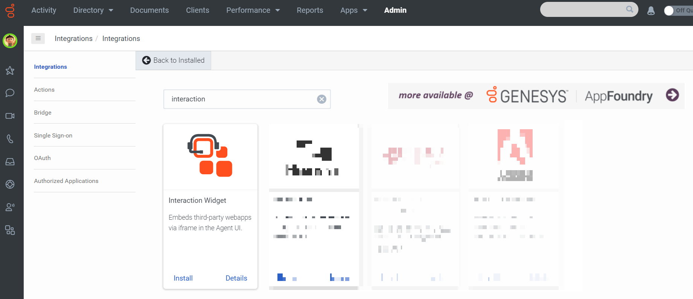
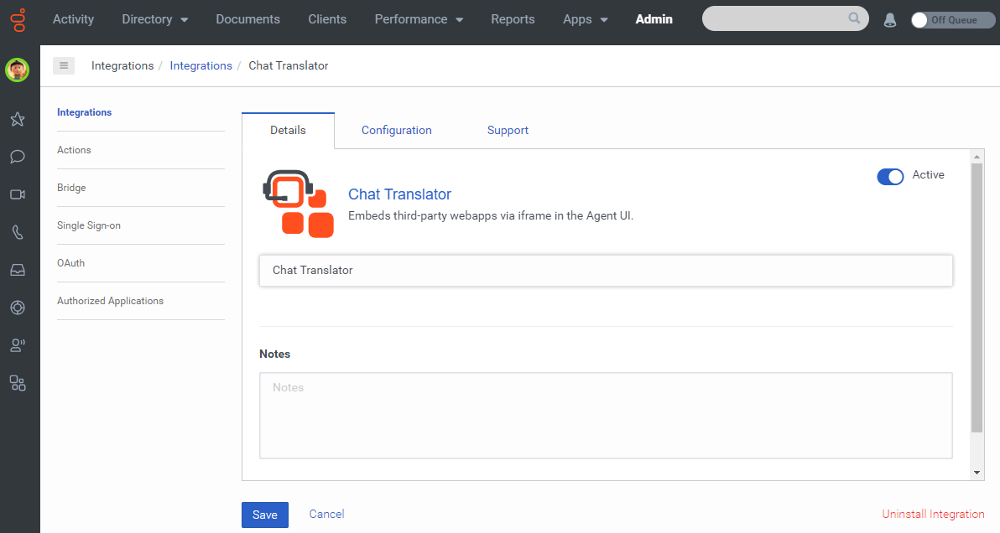
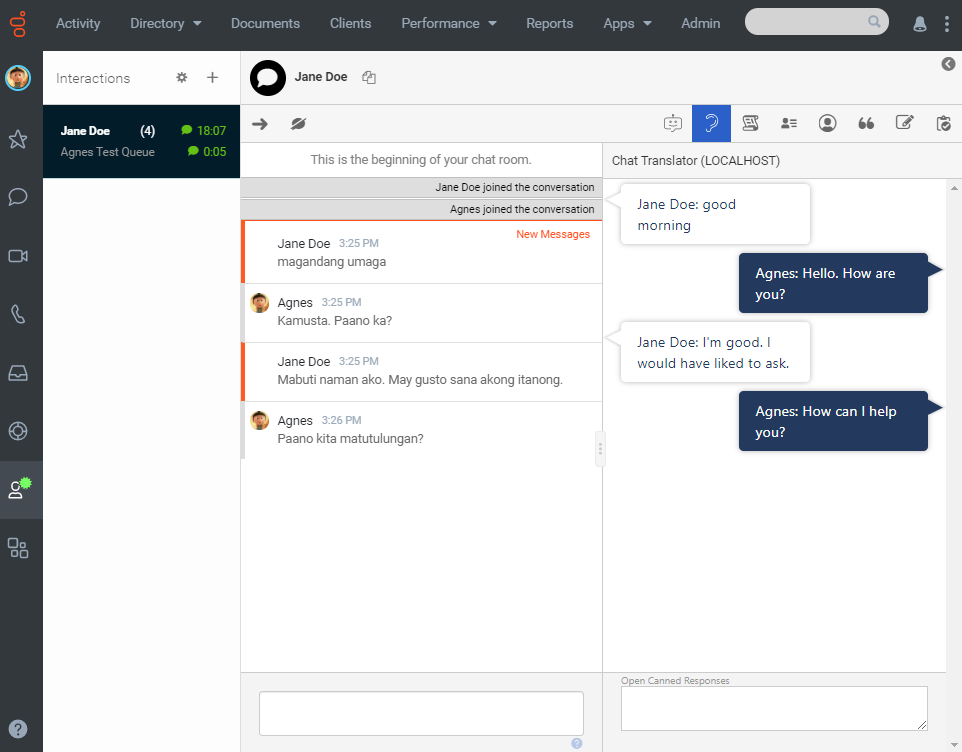

This Genesys Blueprint provides instructions for deploying a chat translator on Genesys Cloud. The Chat Translator uses AWS translate service to determine and translate message from the customer's foreign language to the agent's configured language in Genesys Cloud. The agent will respond using their configured language and the Chat Translator translates the message back to the customer's foreign language. The Chat Translator also supports translation of canned responses configured in Genesys Cloud.

Genesys Cloud uses the Interaction Widget to translate and send messages to the customer.


## Solution Components
* **Genesys Cloud** - The Genesys cloud-based contact center platform. Genesys Cloud is the platform for the Chat Translator solution.
* **Genesys AppFoundry** - The Genesys AppFoundry is an app marketplace for solutions that run on the Genesys Cloud platform. You get the Chat Translator integration used in the solution from the Genesys AppFoundry.
* **Interaction Widget Integration** - This integration type enables web apps to be embedded in an iframe within Genesys Cloud. Each iframe is unique to an interaction and will only show when the interaction is being offered or received by an agent. The client app for this blueprint will be embedded via this integration type.
* **AWS Cloud** - Amazon Web Services (AWS) is Amazon's cloud platform. AWS is the platform for Genesys Cloud and the Chat Translator solution.
* **Amazon Translate** - Amazon Translate is a translation service that delivers fast, high-quality, and affordable language translation. Amazon Translate is the translate service used in the Chat Translator solution.

### Software Development Kit (SDK)
* **Genesys Cloud Platform API SDK** - This SDK is used for the initial interaction of agent and customer over chat.

## Requirements

### Specialized knowledge
Implementing this solution requires experience in several areas or a willingness to learn:
* Administrator-level knowledge of Genesys Cloud and the Genesys AppFoundry
* AWS Cloud Practitioner-level knowledge of AWS Translate
* Genesys Cloud Platform API knowledge

### Genesys Cloud account requirements
This solution requires a Genesys Cloud license. For more information on licensing, see [Genesys Cloud Pricing](https://www.genesys.com/pricing "Opens the pricing article").

A recommended Genesys Cloud role for the solutions engineer is Master Admin. For more information on Genesys Cloud roles and permissions, see the [Roles and permissions overview](https://help.mypurecloud.com/?p=24360 "Opens the Roles and permissions overview article").

### AWS account requirements
The solutions engineer requires an AWS account and administrator level credentials that allow:
* Working with AWS Translate

## Run Locally

The Chat Translator integration has the following stages:
* Download the repository containing the project files
* Create a Token Implicit OAuth Grant for Genesys Cloud
* Create or use existing AWS Translate endpoints
* Install and activate the Chat Translator integration app on Genesys Cloud
* Host and run the NodeJS app server
* Create a Genesys web chat widget and test the Chat Translator solution

### Download the repository containing the project files

1. Go to the [repository](https://github.com/GenesysAppFoundry/chat-translator-blueprint) and clone it to your machine.

### Create a Token Implicit OAuth Grant for Genesys Cloud
1. Login to your Genesys Cloud organization and create a new OAuth API (Implicit Grant(Browser)). [Create an OAuth Client.](https://help.mypurecloud.com/articles/create-an-oauth-client/)
2. Modify [config.js](https://github.com/GenesysAppFoundry/chat-translator-blueprint/blob/main/docs/scripts/config.js) from the blueprint and enter the Client ID and region (i.e. mypurecloud.ie, mypurecloud.au, etc.) for Genesys Cloud.

### Create or use existing AWS Translate endpoints
1. Create or open an existing AWS....
2. Next Steps...
3. Modify [config.js](https://github.com/GenesysAppFoundry/chat-translator-blueprint/blob/main/docs/scripts/config.js) from the blueprint and enter the endpoints to translate text and get token.

### Install and activate the Chat Translator integration app on Genesys Cloud

1. Login to your Genesys Cloud organization and add a new **Integration**.
   
   
2. Install the **Interaction Widget**.
   

3. **(Optional)** Use the Name box to give the app a different name.
   
   
4. Click the **Configuration** tab. In the **Application URL** box, type the URL of the web application. Be sure to specify the full URL, including the https: at the beginning of the URL.
   
   The pcConversationId URL parameter is used to determine the conversation interaction and pcLangTag is used to determine the agent's language in the Chat Translator solution.

   <pre class="language-nohighlight"><code class="language-nohighlight">https://localhost/?conversationid=&#123;&#123;pcConversationId&#125&#125;&language=&#123;&#123;pcLangTag&#125&#125;</code></pre>

   **(Optional)** Select a group for filtering user acces to the widget.

   **(Optional)** Select specific queues for widget access.

   Select the ACD interaction types where you want the widget to be available for.

   
   
5. Go to **Advanced** Configuration and enter this in the text area:

   ```json
   {
     "lifecycle": {
       "ephemeral": false,
       "hooks": {
         "stop": true,
         "blur": true,
         "focus": true,
         "bootstrap": true
       }
     },
     "icon": {
        "48x48": "https://raw.githubusercontent.com/GenesysAppFoundry/chat-translator-blueprint/main/docs/images/ear%2048x48.png",
        "96x96": "https://raw.githubusercontent.com/GenesysAppFoundry/chat-translator-blueprint/main/docs/images/ear%2096x96.png",
        "128x128": "https://raw.githubusercontent.com/GenesysAppFoundry/chat-translator-blueprint/main/docs/images/ear%20128x128.png",
        "256x256": "https://raw.githubusercontent.com/GenesysAppFoundry/chat-translator-blueprint/main/docs/images/ear%20256x256.png"
    },
     "monochromicIcon": {
       "vector": "https://raw.githubusercontent.com/GenesysAppFoundry/chat-translator-blueprint/main/docs/images/ear.svg"
     }
   }
   ```

6. **Save** and **Activate** the integration.

### Host and run the NodeJS app server
1. Open a terminal in the project directory and install the dependencies in the local node-modules folder.
   ```
   npm install
   ```
2. Run the server by entering this in the terminal
   ```
   node run-local.js
   ```

### Testing the solution using Genesys Cloud Web Chats Developer Tool

1. Create a Genesys web chat widget if you haven't already. [Create a widget for web chat](https://help.mypurecloud.com/?p=195772).
   
   :::primary
   **Important:** If you are going to use the Developer Tools to test, make sure to use either of the following widget deployment versions: Version 1.1, Third Party and	Version 2. To know more about widgets for web chat, visit this [link](https://help.mypurecloud.com/articles/about-widgets-for-web-chat/).
   :::

2. Go to Genesys Cloud [Developer Tools](https://developer.mypurecloud.com/developer-tools/#/webchat).
3. Select your deployment and queue and initiate a chat interaction.

Once the agent is offered/answers the incoming interaction, they should see the Chat Translator panel in one of the Agent tools section.


Clicking it will open the Chat Translator. When the customer sends a message in a foreign language, the Chat Translator automatically detects the language and translates it to the agent's configured language in Genesys Cloud.


Clicking the **Open Canned Responses** above the message box allows an agent to send canned response translated to the customer's language.


## Additional Resources

- [Genesys Cloud Developer Center](https://developer.mypurecloud.com/)
- [Genesys Cloud Platform Client SDK](https://developer.mypurecloud.com/api/rest/client-libraries/)